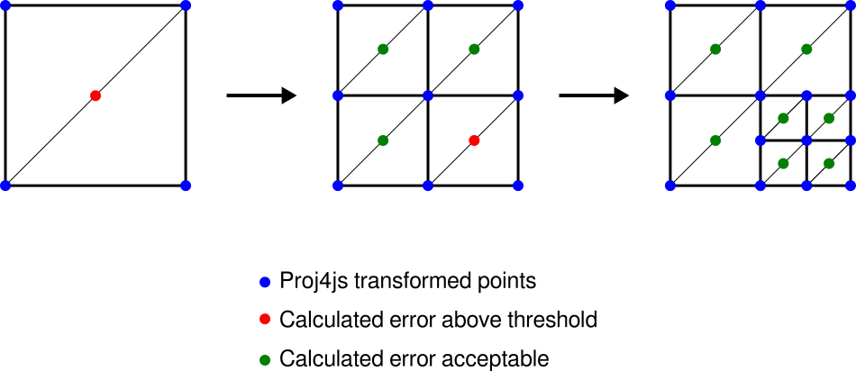

# Introduction
최신 JS는 모듈을 사용하고 제작할 때 잘 작동한다.  
`OpenLayers`를 사용하는 권장 방법은 npm을 사용, `ol` 패키지를 설치하는 거임.  
  
---
  
## Initial Steps
프로젝트를 위한 빈 디렉토리를 새로 만든다음 프로젝트를 초기화.  
  
```
>> npm init

This utility will walk you through creating a package.json file.
It only covers the most common items, and tries to guess sensible defaults.

See `npm help json` for definitive documentation on these fields
and exactly what they do.

Use `npm install <pkg>` afterwards to install a package and
save it as a dependency in the package.json file.

Press ^C at any time to quit.

package name: (02-building an openlayers application) ol_study
version: (1.0.0)
description: OpenLayers Study
entry point: (index.js)
test command:
git repository:
keywords:
author: Jeaha Oh
license: (ISC)
About to write to C:\Users\GMTC_JH\git\OpenLayersStudy\02 Building an OpenLayers Application\package.json:

{
  "name": "ol_study",
  "version": "1.0.0",
  "description": "OpenLayers Study",
  "main": "index.js",
  "scripts": {
    "test": "echo \"Error: no test specified\" && exit 1"
  },
  "author": "Jeaha Oh",
  "license": "ISC"
}

Is this OK? (yes)
```
  
`package.json` 파일이 디렉토리에 생성됨.  
어플리케이션에 대한 종속성으로 OpenLayers와 parcel-bundler 추가.
  
```
npm install ol
npm install --save-dev parcel-bundler
```
  
---
  
## Application Code
간단하게 시작할 수 있는 어플리케이션 코드
- `index.js`  
  ```
    import 'ol/ol.css';
    import {Map, View} from 'ol';
    import TileLayer from 'ol/layer/Tile';
    import OSM from 'ol/source/OSM';

    const map = new Map({
      target: 'map',
      layers: [
        new TileLayer({
          source: new OSM()
        })
      ],
      view: new View({
        center: [15.41, 58.82],
        zoom: 4
      })
    });
  ```
- `index.html`  
  ```
    <!DOCTYPE html>
    <html lang="kor">
    <head>
      <meta charset="utf-8">
      <title>Using Parcel with OpenLayers</title>
      <style>
        #map {
          width: 100%;
          height: 800px;
        }
      </style>
    </head>
    <body>
      <div id="map"></div>
      <script type="text/javascript" src="index.js"></script>
    </body>
    </html>
  ```
  
---
  
## Creating a bundle
`package.json`에 두개의 추가 라인을 사용하면  
번들을 수동으로 만들고 변경 사항을 각각 보기위해  `npm run build`와 `npm start`명령을 사용할 수 있다.  
두개의 추가 명령 `start`와 `build`가 있는 `package.json`은 다음과 같을것임.  
  
```
{
  "name": "ol_study",
  "version": "1.0.0",
  "description": "OpenLayers Study",
  "main": "index.js",
  "scripts": {
    "test": "echo \"Error: no test specified\" && exit 1",
    "start": "parcel index.html",
    "build": "parcel build --public-url . index.html"
  },
  "author": "Jeaha Oh",
  "license": "ISC",
  "dependencies": {
    "ol": "^6.0.1"
  },
  "devDependencies": {
    "parcel-bundler": "^1.12.4"
  }
}
```
  
실행을 하기 위해서 다음 명령을 입력하면 됨.
```
npm start
```
  
`localhost:1234`에 접속하면 테스트 해 볼수 있음.  
무언가를 변경할 때마다 페이지가 자동으로 로드되어 변경 결과를 표시함.  
  
모든 어플리케이션 코드와 어플리케이션에 사용된 모든 종속성이 포함된 단일 JS 파일이 작성 되어 있음.  
OL 패키지에는 필수 구성요소만 포함되어 있음.  
어플리케이션의 상품을 번들로 작성 하려거든 `npm run build` 명령을 입력하면  
`dist/` 폴더가 생기고 서버에 올리면 됨.
  
  ---  

# Basic Concepts
## Map
OpenLayers의 핵심 구성 요소는 지도 (`ol/Map`)임.  
`target` container (ex: `div` 지도가 포함 된 웹 페이지의 요소)로 렌더링 됨.  
모든 지도 속성은 생성시 또는 설정 밥법에 따가 사용을 구성할 수 있음. (ex: `setTarget()`)  
  
```
import Map from 'ol/Map';

var map = new Map({target: 'map'});
```
  
## View
지도는 중심, 확대 / 축소 수준 및 지도 투영과 같은 것을 책임지지 않음.  
이들은 `ol/View` 인스턴스의 속성임.  
  
```
import View from 'ol/View';

map.setView( new View({
  center: [x, y],
  zoom: 8
}));
```
  
`View`는 또한 `projection`을 가지고 있음.  
투영법에 따라 좌표계 `center` 및 지도 축척 계산 단위가 결정됨.  
위의 스니펫과 같이 지정되지 않은 경우 기본 투영법은 미터 단위가 맵 단위인 EPSG: 3857임.  
  
이 `zoom` 옵션은 지도의 축척 지정하는 편리한 방법임.  
사용 가능한 줌 레벨은 다음 3요소에 의해 결정됨.  
`maxZoom`(기본값 : 28),  
`zoomFactor`(기본값 : 2),  
`maxResolution`(기본 값은 프로젝션의 유효 범위가 256 X 256 픽셀 타일에 맞는 방식으로 계산 됨.)  
  
`maxResolution` 픽셀 당 단위의 해상도로 확대 / 축소 단위 0에서 시작하여 `zoomFactor`, `maxZoom`에 도달 할 때까지 축척을 나누어 계산함.

## Source
레이어에 대한 원격 데이터를 얻기 위해 OpenLayers는 `ol/source/Source` 서브 클래스를 사용함.  
OpenStreetMap 또는 Bing과 같은 무료 및 상용지도 타일 서비스,  
WMS 또는 WMTX와 같은 OGG 소스,  
GeoJSON 또는 KML과 같은 형식의 벡터 데이터에 사용할 수 있음.  
  
```
import OSM from 'ol/source/OSM';
var osmSource = OSM();
```
  
## Layer
레이어는 `source`의 데이터를 시각적으로 표현한 것임.  
OpenLayers에는 네가지 기본 유형의 레이어가 있음.  
- `ol/layer/Tile`   : 특정 축척의 클로즈업 수준으로 구성된 격자 이미지로 타일 이미지를 제공하는 소스를 렌더링함.
- `ol/layer/Image`  : 임의의 범위와 해상도로 맵 이미지를 제공하는 소스를 렌더링함.  
- `ol/layer/Vector` : 벡터 데이터를 클라이언트 측으로 렌더링함.
- `ol/layer/VectorTile` : 벡터 타일로 제공되는 데이터를 렌더링함.
  
```
import TileLayer from 'ol/layer/Tile';

var osmLayer = new TileLayer({source: osmSource});
map.addLayer(osmLayer);
```
  
## Putting it all together
위의 스니펫은 단일 레이어로 지도를 렌더링 하는 단일 스크립트로 결합 될 수 있음.  
  
```
import Map from 'ol/Map';
import View from 'ol/View';
import OSM from 'ol/source/OSM';
import TileLayer from 'ol/layer/Tile';

new Map({
  layers : [
    new TileLayer({ source : new OSM() })
  ],
  view : new TileLayer({
    center: [0, 0],
    zoom: 2
  }),
  target: 'map'
})
```
  
---
# Background
## Objectives
OpenLayers는 지도 및 지리 공간 데이터를 표시하고 상호작용하기 위한 기능이 풍부한 모듈형 라이브러리임.  
이 라이브러리는 광범위한 상업용 및 무료 이미지, 벡터 타일 소스와 가장 널리 사용되는 공개 및 독점 데이터 형식을 기본적으로 지원함.  
OpenLayers의 지도 투영 지원을 통해 데이터는 모든 투영에 있을 수 있음.  

## Public API
OpenLayers는 공식적으로 지원되는 API의 모든 모듈을 지공하는 `ol` `npm Package`로 제공됨.  
  
## Renderers and Browser Support
기본적으로 OpenLayers는 성능 최적화 캔버스 렌더러를 사용함.  
OL은 HTML5, ECMAScript5 를 지원하는 모든 최신 브라우저에서 실행됨.  
IE나 Android 4.x같은 구형 브라우져나 플렛폼 같은 경우는 Babel과 같은 번들 어플리케이션을 사용해서 transpiled 해야 함.  
라이브러리는 데스크톱, 노트북, 모바일 모두 지원되도록 고안 되었으며 포인터 및 터치 상호작용을 지원함.  
  
## Module and Naming Conventions
OpenLayers 모듈은 CamelCase로 이름지어진 클래스를 기본 제공하며,  
추가 상수 혹은 함수를 포함 시킬 수 있음.  
  
```
import Map from 'ol/Map';
import View from 'ol/View';
```
  
부모별로 그룹화 된 클래스 계층은 패키지의 하위 폴더에 제공됨.  
편의상 이런애들도 import할 수 있음.  
  
```
import {Map, View} from 'ol';
import {Tile, Vector} from 'ol/layer';
```
  
이런 re-export된 클래스 외에도 소문자 이름을 가진 모듈은 상수 또는 함수로 import 할 수 있음.  
  
```
import {getUid} from 'ol';
import {frontLonLat} from 'ol/proj';
```
  
---
## Raster Reprojection
OpenLayers는 WMS, WMTS, 정적 이미지 및 기타 여러 소스의 래스터 데이터를 서버와 다른 좌료계료 표시할 수 있음.  
이미지의 지도 투영 변환은 웹 브라우져에서 직접 발생함.  
Proj4js가 지원하는 좌표 참조 시스템의 보여주기가 가능하며 이전에는 호환되지 않는 레이어를 결합하여 오버레이 할 수 있음.
  
## Usage
API 사용법은 간단함.  
ESPG 코드를 사용하여 `ol/View`에 적절한 투영을 지정하면 됨.  
```
import {Map, View} from 'ol';
import TileLayer from 'ol/layer/Tile';
import TileWMS from 'ol/source/TileWMS';

var map = new Map({
  target: 'map',
  view: new View({
    projection: 'EPSG:3857',  //  <--- VIEW PROJECTION임
    center: [0, 0],
    zoom: 2
  }),
  layer: [
    new TileLayer({
      source: new TileWMS({
        projection: 'EPSG:4326',  //  <--- DATA SOURCE PROJECTION임
        url: 'https://ahocevar.com/geoserver/wms',
        params: {
          'LAYERS': 'ne:NE1_HR_LC_SR_W_DR'
        }
      })
    })
  ]
});
```
만약 소스(`ol/source/TileImage`나 `ol/source/Image`)의 투영이 현재 `ol/View`의 투영과 다른경우 후드 아래에서 자동으로 재 투영이 수행됨.

### Example
이 페이지 학습 후 예제를 진행하는게 나을듯.
  - Raster Reprojection DEMO
  - OpenStreetMap to WGS84 reprojection
  - Reprojection with EPSG.io database search
  - Image reprojection

### Custom Projection
사용자 정의 프로젝션을 사용하는 가장 쉬운 방법은 프로젝트에 `Proj4js` 라이브러리를 추가 한 다음  
proj4 정의 문자열을 사용하여 프로젝션을 정의하는 것임.  
  
```
npm install porj4
```
  
다음 예제는 영국 내셔널 그리드의 정의를 보여줌.
```
import proj4 from 'proj4';
import {get as getProjection, register} from 'ol/proj';

proj4.defs('EPSG:27700', '+proj=tmerc +lat_0=49 +lon_0=-2 +k=0.9996012717 ' +
    '+x_0=400000 +y_0=-100000 +ellps=airy ' +
    '+towgs84=446.448,-125.157,542.06,0.15,0.247,0.842,-20.489 ' +
    '+units=m +no_defs');
regitster( proj4 );

var proj27700 = getProjection( 'EPSG:27700' );
proj27700.setExtent( [0, 0, 700000, 13000000] );
```
  
### Change of the view projection
지도를 표시하는 데 사용되는 투영을 전환하려면 `ol/Map`에서 선택한 투영을 사용하여 새 `ol/View`를 설정을 해야 함.
  
```
map.setView( new View({
  projection: 'EPSG:27700',
  center: [400000, 650000],
  zoom: 4
}));
```
  
### TileGrid and Extents
재 투영이 필요한 경우 대상 투영의 새 타일이 원본 소스 타일에서 생성된 후드 아래에 있음.  
재 투영 된 타일의 TileGrid는 기본적으로 내부 `ol/tilegrid~getForProjection( projection )`를 사용하여 구성됨.  
이것이 제대로 작동하려면 위와같이 투영에 범위가 정의되어 있어야 함.  
또는 사용자 지정 대상 TileGrid를 수동으로 구성하고, `ol/source/TileImage~setTileGridForProjection( projection, tilegrid )`를 사용하여 소스 인스턴스에 설정할 수 있음.  
이 TileGrid는 기본 투영을 작성하는 대신 지정된 투영으로 재 프로젝션 할 때 사용됨.  
특정 경우, 이는 성능(타일크기) 또는 시각적 품질(해상도)을 최적화 하는데 사용할 수 있다.  
  
  ---

## How It Works
재 투영 프로세스는 삼각형을 기반으로 함.  
대상 래스터는 `ol/proj` 기능을 사용하여 변환 된 장점이 있는 제한된 수의 삼각형으로 나뉨.  
(proj4js는 일반적으로 사용자 지정 변환을 정의하는데 사용됨.)  
삼각형 내부의 픽셀 재 투영은 affine 변환으로 근사됨.  
  
(캔버스 2d 컨택스트에 의해 렌더링 하드웨어 가속을 통해)  
이런 식으로 비교적 적은 수의 실제 변환 계산으로 거의 모든 하드웨어에서 proj4js 또는 사용자 정의 함수의 광범위한 프로젝션을 지원할 수 있음.  
재 투영의 정밀도는 삼각형의 수에 의해 제한됨.  
재 투영 프로세스는 소스(png 또는 gif)에서 공급된 래스터 데이터의 투명성을 유지하고 재 투영에 의해 생성 된 간격과 비 데이터 픽셀은 자동으로 투영함.  
  
### Dynamic triangulation
위의 이미지는 원본 이미지( 왼쪽; EPSG:27700 )가 제한된 수의 삼각형( 오른쪽; EPSG:3867 )으로 변환될 때 눈에 띄는 오류(특히 가장자리)를 보여줌.  
사용 된 삼각형 수를 늘려 오류를 최소화 할 수 있음.  
일부 변환에는 보다 자세한 삼각 측량 네트워크가 필요하므로 독적 삼각 측략 프로세스는 자동으로 재 투영 오류를 측정하고 특정 오류 임계 값을 충족하기 위해 반복적으로 세분화 함.  
  
디버깅을 위해 재 투영 엣지 렌더링을 활겅화 할 수 있음.  
`ol.source.TileImage#setRenderReprojectionEdges( true )`  
  
  --

## Advanced
### Triangulation procision threshold
픽셀 단위의 기본 삼각 측량 오류 임계 값은 `ERROR_THRESHOLD`(0.5 픽셀)로 제공됨.  
다른 소스에 대해 다른 임계 값을 정의해야하는 경우,  
`reprojectionErrorThreshold` 옵션을 타일 이미지 소스를 구성 할 때 전달할 수 있음.  
  
## Limiting visiblity of reproejcted map by extent
재 투영 알고리즘은 뷰 프로젝션에서 데이터 프로젝션으로 역변환을 사용함.  
특정 좌표계의 경우 지도에서 소스 데이터가 이중으로 발생할 수 있음.  
예를 즐어 EPSG:21781에서 EPSG:3857로 스위스 지도를 재 투영 할 때,
  유럽의 올바른 위치와 지구 반대편의 뉴질랜드 근처 태평양에 두 번 표시 됨.  
  
이는 역 변환의 수학적으로 올바른 동작이지만 여러 위치에서 레이어의 가시성은 사용자에게 기대되지 않음.  
가능한 일반적인 해결책은 모든 정점에 대한 수방향 변환을 계산하는 것이지만 성능이 크게 저하됨.  
(특히 계산 비용이 많이 드는 변환의 경우)  
따라서 권장되는 해결 방법은 `ol.layer.Tile` 뷰 투영에서 적절한 가시성 범위를 정의하는 것임.  
이러한 한계 설정은 재 투영 데모 예제에서 알수 있음.  
  
## 축척 계산
로드 할 소스 타일을 결정할 때 이상적인 소스 축적을 계산해야 함.  
이 `ol/reproj~calculateSourceResolution( sourceProj, targetProj, targetCenter, targetRecolution )` 함수는 재 투영중에 가능한 1:1 에 가까운 픽셀 매핑을 달성하기 위해 이상적인 값을 계산 한 다음 소스에서 적절한 줌 레벨을 선택하는 데 사용됨.  
그러나 일반적으로 전체 대상 줌 레벨에 대해 동일한 소스 줌 레벨을 사용하는 것은 실용적이지 않음.  
투영에 따라 세계의 다른 지역( 에: EPSG:3857 VS EPSG:4326의 극지방)에 따라 축척이 크게 다를 수 있음.  
전체 확대 / 축소 수준에 단일 축적을 적용하면 일부 타일이 확대 축소 되어 막대한 후의 소스 타일을 로드해야 할 수 있음.  
따라서 축척 매핑은 각 재 투영 된 타일(타일 범위의 중간) 에 대해 별도로 계산 됨.